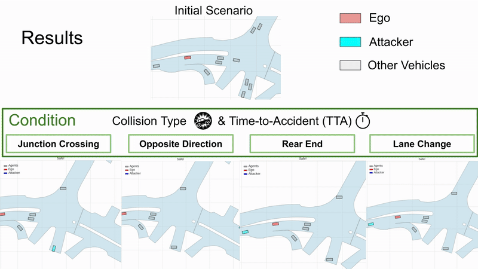

# Controllable Collision Scenario Generation via Collision Pattern Prediction

[](https://www.youtube.com/watch?v=W-_sarZqfMo)
[](https://arxiv.org/abs/2510.12206)
[](LICENSE)

---

This repository contains the official code for **Controllable Collision Scenario Generation via Collision Pattern Prediction**,  
a method for controllable collision scenario generation in autonomous driving.

**Authors:** Pin-Lun Chen, Chi-Hsi Kung, Che-Han Chang, Wei-Chen Chiu, Yi-Ting Chen  
**Affiliation:** [National Yang Ming Chiao Tung University](https://www.nycu.edu.tw)

---

<p align="center">
  
</p>

*Generated scenarios covering five representative collision types (Lane Change, Opposite Direction, Rear-End, Junction Crossing, LTAP) with controllable time-to-accident.*


### System Requirements
* Linux ( Tested on Ubuntu 18.04 )
* Python3 ( Tested on Python 3.8 )
* PyTorch ( Tested on PyTorch 1.8.0 )
* CUDA ( Tested on CUDA 11.1 )
* GPU ( Tested on Nvidia RTX3090Ti )
* CPU ( Tested on Intel Core i7-12700, 12-Core 20-Thread )

* [NuScenes-api](https://www.nuscenes.org/nuscenes#download)

## Usage

### Preprocessing

bash scripts/preprocessing_data.bash

### Training
To train the condition collision scenario generation model with COLLIDE:
    ```
    bash scripts/train.bash
    ```

### Inference

To generate prediction results:
```
python test_tnt.py
```

### Video visualization

To generate video result based on .csv files created in the inference stage:
```
python plot_and_metric.py
```

### Citation

```
@article{chen2025controllable,
  title={Controllable Collision Scenario Generation via Collision Pattern Prediction},
  author={Chen, Pin-Lun and Kung, Chi-Hsi and Chang, Che-Han and Chiu, Wei-Chen and Chen, Yi-Ting},
  journal={arXiv preprint arXiv:2510.12206},
  year={2025}
}
```